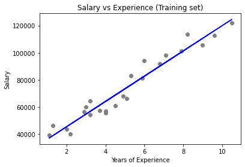

# Predicting new employees salaries
Simple Linear Regression algorithm trained with Python

## Introduction

This project was created for learning purposes. In order to practice ML algorithms in Python, this first and very simple ML algorithm is a regression where we want to predict the salary (dependent variable) based on years of experience (independent variable). The parameters learnt can be used on the equation Salary = b0 + b1*Years of Experience to predict how much a company should pay to a new employee based on their experience.

## Technologies

Python 3.9 (IDE: Spyder)
libraries: scikit learn, numpy and matplotlib

## Results & Illustrations
The whole code can be viewed on the file slr-training.
The class LinearRegression() in Python fitted the linear model on the training dataset. 
The predict function was used on the test dataset.

